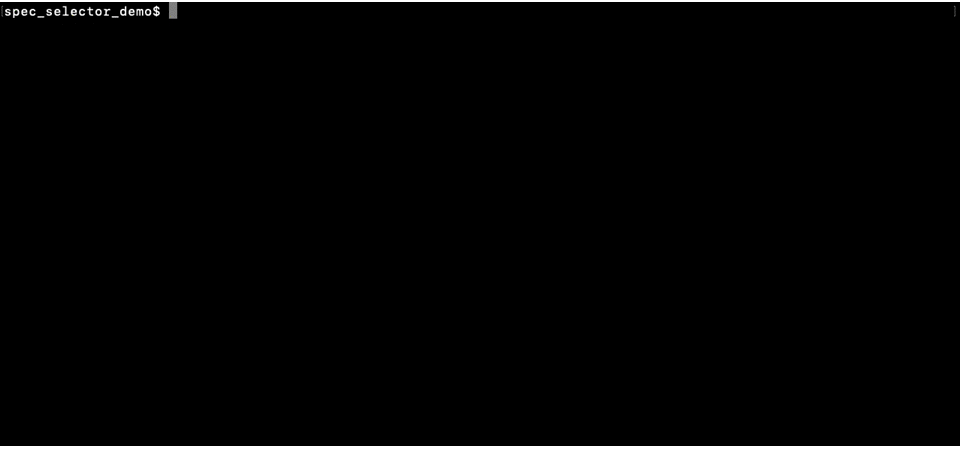
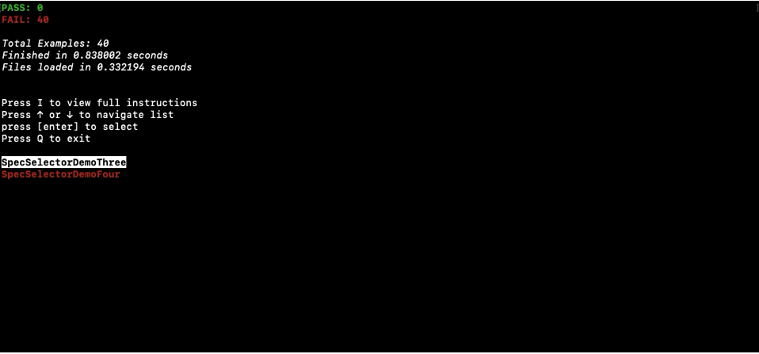
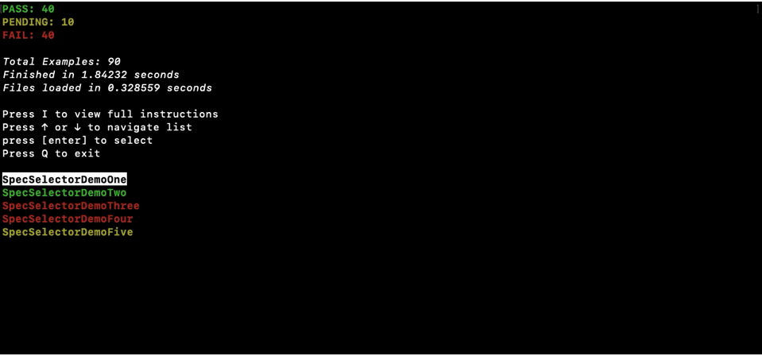

# spec_selector

spec_selector is an interactive 'custom formatter' for RSpec that facilitates quick navigation and filter control of example run results. 

**How it works**

At the end of an example run, spec_selector displays a list of top-level
example groups. Select an example group to view its subgroups. Press backspace to view the list that includes the parent of the current list.

_example group tree_

Select an example to view a result summary. The summary page of a failed or pending example will display all of the usual information about why it failed or is pending. Press T at any point to view the top failed example. Press escape to return to the top-level list.

_example summary display_

Press M to mark the selected example or example group for inclusion in the next run. Press R to rerun examples with the filter selection (or to rerun all examples if the filter is empty). Press F to rerun only failed results from the current set.

_inclusion filter_

_fails only_

Press C to clear the inclusion filter at any time. Press A to clear the inclusion filter and rerun all examples. 

_clear and rerun_

If unsure how to perform an action, press I to view the instructions

_instructions_

**Availability**

This project is currently still in development and will soon be released as a gem through rubygems.org. At that time, it will be available to all.

**Author**

Trevor Almon